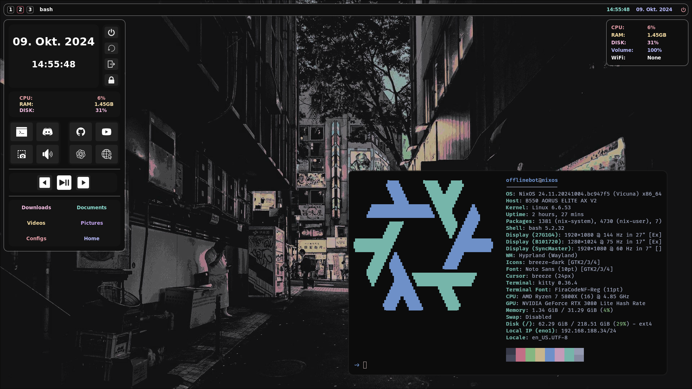

# My NixOS configurations
This repository contains my NixOS/home-manager configuration files. It requires `flakes` and `home-manager standalone`.

*Usage*:
- Configuration for Pc and Laptop
- Everything in one place
- School:
    * LaTeX + Zathura + VimTeX
    * Obsidian
- Gaming:
    * Steam
    * Lutris
    * Discord
- Programming:
    * Neovim
    * NodeJS, C++, Rust, Python, ...
- WindowManager:
    * GNOME (some extensions in `home-manager`)
    * Hyprland (fully customized with: AGS + Swaylock + swww)
- SDDM

## Structure
It's split into the directories `nixos` and `home-manager`. `nixos` is the systems configuration and `home-manager` is the users configuration.

Basic look of the tree:

```
nixos
|- flake.nix
|   |- laptop 
|   |   |- ...
|   |
|   |- pc
|   |   |- ...
|   |
|   |- shared
|   |   |- ...
|
home-manager
|- flake.nix
|   |- laptop
|   |   |- ...
|   |
|   |- pc
|   |   |- ...
|   |
|   |- shared
|   |   |- ...
|   |
```

Each `shared` folder has an `default.nix` that includes everything inside and each `src` folder contains the actual data that is going to be linked.


## Installation
To install simply clone this repository: `git clone https://github.com/OfflineBot/nixos.git` (you can put the content anywhere in your System. For example inside `~/System`).

Make sure to have `home-manager standalone` installed.

To activate `system` configurations, `cd` into the `nixos` directory and run:
```
sudo nixos-rebuild switch --flake .#pc
```
or 
```
sudo nixos-rebuild switch --flake .#laptop
```

To activate `home-manager` configurations, `cd` into the `home-manager` directory and run:
```
home-manager switch --flake .#pc
```
or 
```
home-manager switch --flake .#laptop
```

## Screenshots (Hyprland)


## Credit
The SDDM design is just the `sddm-sugar-candy` theme with a different wallpaper (maybe changes in the future). <br>
The `sddm-sugar-candy` repository: `https://github.com/Kangie/sddm-sugar-candy`
